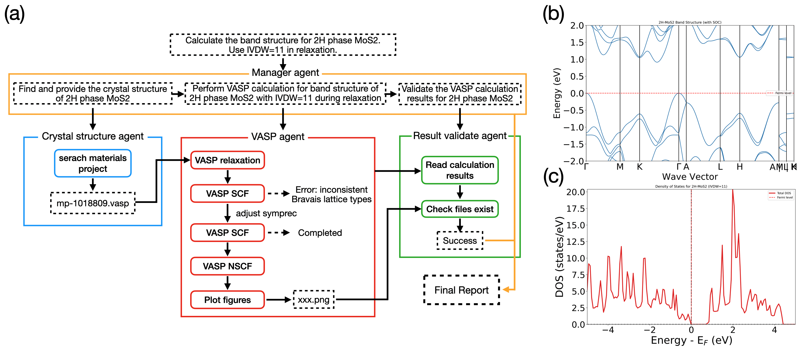

# VASPilot

[中文版本](README_zh.md)

**VASP automation and analysis using CrewAI framework with MCP support**

VASPilot is an open-source platform that fully automates VASP workflows via a multi-agent architecture built on the CrewAI framework and a standardized Model Context Protocol (MCP). It handles every stage of a VASP study-from retrieving crystal structures and generating input files to submitting Slurm jobs, parsing error messages, and dynamically adjusting parameters for seamless restarts. 

## Architecture


VASPilot follows a modular, multi-agent architecture consisting of several key components:

### Core Components

- **CrewAI Framework**: Multi-agent orchestration system that manages specialized AI agents
- **MCP Server**: Model Control Protocol server providing tools for VASP calculations and materials analysis
- **Quart and Flask Web Server**: Web interface for task submission and monitoring
- **Specialized Agents**:
  - **Crystal Structure Agent**: Handles structure search, analysis, and manipulation
  - **VASP Agent**: Manages VASP calculations (relaxation, SCF, NSCF)
  - **Result Validation Agent**: Validates and analyzes calculation results
  - **Manager Agent**: Coordinates tasks between agents using hierarchical process

### Key Features

- **Intelligent Task Management**: AI agents automatically plan and execute complex workflows
- **Materials Project Integration**: Direct access to crystal structures from Materials Project database
- **VASP Automation**: Automated setup and execution of VASP calculations
- **Memory Systems**: Long-term, short-term, and entity memory for context retention
- **Real-time Monitoring**: Web interface for task tracking and result visualization
- **Database Storage**: SQLite-based storage for calculation records and metadata

## Installation

### Prerequisites

- Python ≥ 3.10
- Slurm

### Quick Installation

1. Clone the repository:
```bash
git clone https://github.com/JiaxuanLiu-Arsko/VASPilot.git
cd VASPilot
```

2. Install the package:
```bash
pip install .
```

This will automatically install all required dependencies including CrewAI, FastMCP, PyMatGen, ASE, and other materials science libraries.

## Usage

VASPilot requires configuration of two main components: the MCP server and the CrewAI server. Follow the basic setup example in `examples/1.Basic/` for initial configuration.

### Prerequisites Configuration

Before starting VASPilot, you need to configure several system-specific parameters:


#### 1.Prepare Directories & Files

Ensure the following directories exists and has been properly configured as in [Example](examples/1.Basic/):
  - `mcp/` : Directories for MCP server
    - `attachment/`: VASP job templates and auxiliary files
        - `slurm.sh`: slurm script for submitting VASP calculations
        - `vdw_kernel.bindat`: vdW kernel files. See https://www.vasp.at/wiki/index.php/Nonlocal_vdW-DF_functionals#Kernel_file_vdw_kernel.bindat for details
    - `work/`: MCP tools working directories
    - `record/`: Directory to store execution record of MCP tools
    - `downloads/`: Directory to store downloaded structure files
    - `uploads/`: User uploaded files
  - `crew_server/` : Directories for web server and crewAI.
    - `work/`: Web server working directories
  - `configs/`: 
    - `crew_config.yaml`: Configuration file for crewAI components.
    - `crew_config_en.yaml`: Configuration file with english prompts.
    - `mcp_config.yaml`: Configuration file for MCP server

#### 2. MCP Server Configuration

Edit `configs/mcp_config.yaml` and configure the following paths according to your system:

```yaml
# Directory for VASP job files (slurm.sh, vdw_kernel.bindat, etc.)
attachment_path: your-path-to-example/mcp/attachment

# Working directory for calculations
work_dir: your-path-to-example/mcp/work

# Database path for calculation records
db_path: your-path-to-example/record/record.db

# Materials Project API key
mp_api_key: your-mp-api-key

# Directory for downloaded structures
structure_path: your-path-to-example/mcp/downloads
```

#### 3. CrewAI Server Configuration

Edit `configs/crew_config.yaml` and configure:

```yaml
llm_mapper:
  your-model-name:
    base_url: http://your.llm.server:port/v1
    api_key: your-api-key
    model: openai/your-model-name
    temperature: 0

# Embedding model for RAG memory
embbeder:
  url: http://your.embedding.server:port/v1/embeddings
  model_id: BAAI/bge-m3
  api_key: your-api-key

# MCP server connection
mcp_server:
  url: http://localhost:8933/mcp
  transport: streamable-http
```

#### Required API Keys

- **Materials Project API**: Required for structure search functionality
- **LLM API**: Required for AI agent functionality (supports OpenAI-compatible APIs)
- **Embedding API**: Required for memory and RAG functionality


### Starting the Services

#### 1. Start MCP Server

Before starting the MCP server, you should setup the environment variable pointing to the POTCAR:

```bash
export PMG_VASP_PSP_DIR=/path/to/your/POTCARS/
```

Then, start the MCP server which provides tools for VASP calculations:

```bash
vaspilot_mcp --config /path/to/configs/mcp_config.yaml --port 8933
```

Or equivalently, use the provided script:
```bash
cd examples/1.Basic/mcp/
# Edit start_mcp_server.sh with your paths
./start_mcp_server.sh
```

#### 2. Start CrewAI Server

Start the main CrewAI server with `Quart` web interface:

```bash
vaspilot_quart --config /path/to/configs/crew_config.yaml --port 51293 --work-dir /path/to/work/directory --allow-path /path/to/project/ \ 
--max-concurrent-tasks 2 --max-queue-size 10
```

Or use the provided script:
```bash
cd examples/1.Basic/crew_server/
# Edit start_crew_server.sh with your paths
./start_crew_server.sh
```

### Accessing the Web Interface

Once both servers are running, access the web interface at:
```
http://localhost:51293
```

From the web interface, you can:
- Submit new calculation tasks
- Monitor running calculations
- View calculation history
- Download results and analysis reports

## Example Prompts

### Band structure and Density of States (DOS) calculations

**Example Prompt**: Calculate the band structure of 2H phase MoS2. Use IVDW=11 in relaxation.

**Workflow and Results**: 


### Other Missions:

1. **ENCUT Convergence Test**: Use dierent ENCUT (from 300 to 500) to calculate the total energy of 2H phase MoS2.

2. Calculate and compare the c lattice constant of 2H MoS2
with 12.294 Å (experiment value) using dierent vdW
corrections.
The settings of dierent vdW functionals are listed below:
.....
Plot an intuitve gure as result.

3. **Band Gap Comparison**: Calculate and compare the bandgap of MoS2, MoSe2, WS2 and WSe2. Plot an intuitive gure as result.

**Results**:


## License

This project is licensed under the LGPL v2.1. See the [LICENSE](LICENSE) file for details.

## Authors

- **Jiaxuan Liu** - liujiaxuan23@mails.ucas.ac.cn
- **Quansheng Wu** - quansheng.wu@iphy.ac.cn

## Contributing

Contributions are welcome! Please feel free to submit issues and pull requests.

## Citation

If you find VASPilot helpful, you are welcome to cite this article:

```bibtex
@misc{liu2025vaspilot,
      title={VASPilot: MCP-Facilitated Multi-Agent Intelligence for Autonomous VASP Simulations}, 
      author={Jiaxuan Liu and Tiannian Zhu and Caiyuan Ye and Zhong Fang and Hongming Weng and Quansheng Wu},
      year={2025},
      eprint={2508.07035},
      archivePrefix={arXiv},
      primaryClass={cond-mat.mtrl-sci},
      url={https://arxiv.org/abs/2508.07035}, 
}
```

## Relevant Links

### CrewAI
  - [Website](https://www.crewai.com/)
  - [Github Repository](https://github.com/crewAIInc/crewAI)
  - [Document](https://docs.crewai.com/en/introduction)

### MCP
  - [Github Repositories](https://github.com/modelcontextprotocol)
  - [Document](https://modelcontextprotocol.io/docs/getting-started/intro)
  - [FastMCP](https://github.com/jlowin/fastmcp)

### Flask
  - [Gihub Repository](https://github.com/pallets/flask)
  - [Website](https://flask.palletsprojects.com/en/stable/)

### Quart
  - [Gihub Repository](https://github.com/pallets/quart)
  - [Website](https://quart.palletsprojects.com/en/latest/)

### Pymatgen
  - [Github Repository](https://github.com/materialsproject/pymatgen)
  - [Website](https://pymatgen.org/)