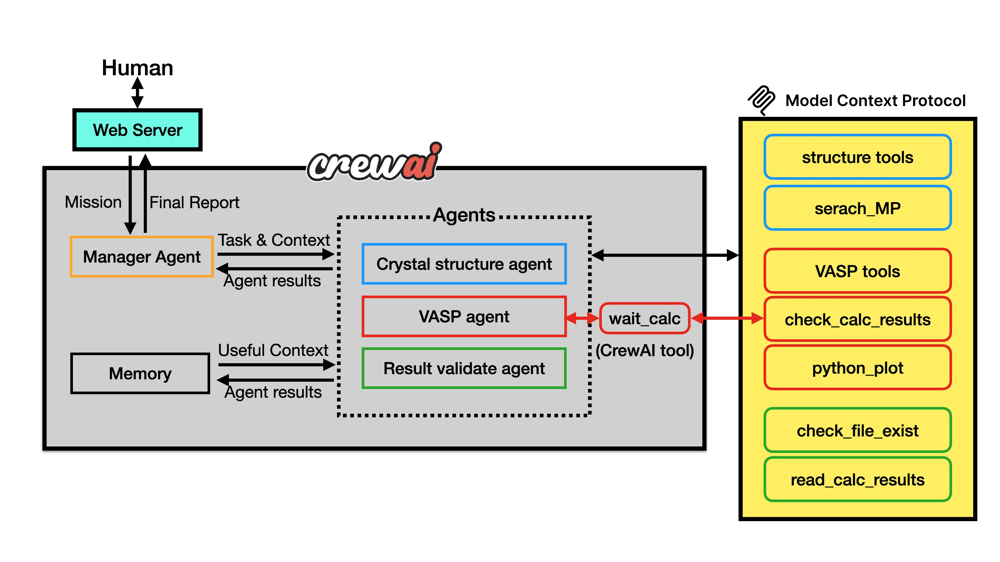

# VASPilot

[English version](README.md)

**基于CrewAI框架和MCP支持的VASP自动化与分析工具**

VASPilot是一个开源平台，通过基于CrewAI框架构建的多智能体架构和标准化的模型控制协议（MCP），实现VASP工作流的全自动化。它处理VASP研究的每个阶段——从检索晶体结构和生成输入文件到提交Slurm作业、解析错误信息以及动态调整参数以实现无缝重启。

## 架构



VASPilot采用模块化、多智能体架构，由几个关键组件组成：

### 核心组件

- **CrewAI框架**：管理专业AI代理的多智能体编排系统
- **MCP服务器**：提供VASP计算和材料分析工具的模型控制协议服务器
- **Flask Web服务器**：用于任务提交和监控的Web界面
- **专业代理**：
  - **晶体结构代理**：处理结构搜索、分析和操作
  - **VASP代理**：管理VASP计算（弛豫、SCF、NSCF）
  - **结果验证代理**：验证和分析计算结果
  - **管理代理**：使用分层流程协调代理间的任务

### 主要特性

- **智能任务管理**：AI代理自动规划和执行复杂工作流
- **Materials Project集成**：直接访问Materials Project数据库中的晶体结构
- **VASP自动化**：自动设置和执行VASP计算
- **记忆系统**：用于上下文保持的长期、短期和实体记忆
- **实时监控**：用于任务跟踪和结果可视化的Web界面
- **数据库存储**：基于SQLite的计算记录和元数据存储

## 安装

### 前置要求

- Python ≥ 3.10
- Slurm

### 快速安装

1. 克隆代码库：
```bash
git clone https://github.com/JiaxuanLiu-Arsko/VASPilot.git
cd VASPilot
```

2. 安装软件包：
```bash
pip install .
```

这将自动安装所有必需的依赖项，包括CrewAI、FastMCP、PyMatGen、ASE和其他材料科学库。

## 使用方法

VASPilot需要配置两个主要组件：MCP服务器和CrewAI服务器。请按照`examples/1.Basic/`中的基本设置示例进行初始配置。

### 前置配置

在启动VASPilot之前，你需要配置几个系统特定的参数：

#### 1. 准备目录和文件

确保以下目录存在并已按照[示例](examples/1.Basic/)正确配置：
  - `mcp/`：MCP服务器目录
    - `attachment/`：VASP作业模板和辅助文件
        - `slurm.sh`：用于提交VASP计算的slurm脚本
        - `vdw_kernel.bindat`：vdW核文件。详情请参阅 https://www.vasp.at/wiki/index.php/Nonlocal_vdW-DF_functionals#Kernel_file_vdw_kernel.bindat
    - `work/`：MCP工具工作目录
    - `record/`：存储MCP工具执行记录的目录
    - `downloads/`：存储下载的结构文件的目录
    - `uploads/`：用户上传文件目录
  - `crew_server/`：Web服务器和crewAI的目录
    - `work/`：Web服务器工作目录
  - `configs/`：
    - `crew_config.yaml`：crewAI组件的配置文件
    - `crew_config_en.yaml`：带英文提示的配置文件
    - `mcp_config.yaml`：MCP服务器的配置文件

#### 2. MCP服务器配置

编辑`configs/mcp_config.yaml`并根据你的系统配置以下路径：

```yaml
# VASP作业文件目录（slurm.sh、vdw_kernel.bindat等）
attachment_path: your-path-to-example/mcp/attachment

# 计算工作目录
work_dir: your-path-to-example/mcp/work

# 计算记录数据库路径
db_path: your-path-to-example/record/record.db

# Materials Project API密钥
mp_api_key: your-mp-api-key

# 下载结构的目录
structure_path: your-path-to-example/mcp/downloads
```

#### 3. CrewAI服务器配置

编辑`configs/crew_config.yaml`并配置：

```yaml
llm_mapper:
  your-model-name:
    base_url: http://your.llm.server:port/v1
    api_key: your-api-key
    model: openai/your-model-name
    temperature: 0

# RAG记忆的嵌入模型
embbeder:
  url: http://your.embedding.server:port/v1/embeddings
  model_id: BAAI/bge-m3
  api_key: your-api-key

# MCP服务器连接
mcp_server:
  url: http://localhost:8933/mcp
  transport: streamable-http
```

#### 必需的API密钥

- **Materials Project API**：结构搜索功能所需
- **LLM API**：AI代理功能所需（支持OpenAI兼容API）
- **嵌入API**：记忆和RAG功能所需

### 启动服务

#### 1. 启动MCP服务器

在启动MCP服务器之前，你应该设置指向POTCAR的环境变量：

```bash
export PMG_VASP_PSP_DIR=/path/to/your/POTCARS/
```

然后，启动提供VASP计算工具的MCP服务器：

```bash
vaspilot_mcp --config /path/to/configs/mcp_config.yaml --port 8933
```

或者，使用提供的脚本：
```bash
cd examples/1.Basic/mcp/
# 使用你的路径编辑start_mcp_server.sh
./start_mcp_server.sh
```

#### 2. 启动CrewAI服务器

启动带有Web界面的主CrewAI服务器：

```bash
vaspilot_server --config /path/to/configs/crew_config.yaml --port 51293 --work-dir /path/to/work/directory --allow-path /path/to/project/
```

或使用提供的脚本：
```bash
cd examples/1.Basic/crew_server/
# 使用你的路径编辑start_crew_server.sh
./start_crew_server.sh
```

### 访问Web界面

两个服务器运行后，在以下地址访问Web界面：
```
http://localhost:51293
```

通过Web界面，你可以：
- 提交新的计算任务
- 监控正在运行的计算
- 查看计算历史
- 下载结果和分析报告

## 示例提示

### 能带结构和态密度（DOS）计算

**示例提示**：计算2H相MoS2的能带结构。在弛豫中使用IVDW=11。

**工作流和结果**：


### 其他任务：

1. **ENCUT收敛测试**：使用不同的ENCUT（从300到500）计算2H相MoS2的总能量。

2. 使用不同的vdW修正计算并比较2H MoS2的c晶格常数与12.294 Å（实验值）。
不同vdW泛函的设置如下：
.....
绘制直观的结果图。

3. **带隙比较**：计算并比较MoS2、MoSe2、WS2和WSe2的带隙。绘制直观的结果图。

**结果**：


## 许可证

本项目采用LGPL v2.1许可证。详情请参阅[LICENSE](LICENSE)文件。

## 作者

- **刘家轩** - liujiaxuan23@mails.ucas.ac.cn
- **吴泉生** - quansheng.wu@iphy.ac.cn

## 贡献

欢迎贡献！请随时提交issue和pull request。

## 引用

如果你觉得VASPilot对你有帮助，欢迎引用这篇文章：

```bibtex
@misc{liu2025vaspilot,
      title={VASPilot: MCP-Facilitated Multi-Agent Intelligence for Autonomous VASP Simulations}, 
      author={Jiaxuan Liu and Tiannian Zhu and Caiyuan Ye and Zhong Fang and Hongming Weng and Quansheng Wu},
      year={2025},
      eprint={2508.07035},
      archivePrefix={arXiv},
      primaryClass={cond-mat.mtrl-sci},
      url={https://arxiv.org/abs/2508.07035}, 
}
```

## 相关链接

### CrewAI
  - [网站](https://www.crewai.com/)
  - [Github代码库](https://github.com/crewAIInc/crewAI)
  - [文档](https://docs.crewai.com/en/introduction)

### MCP
  - [Github代码库](https://github.com/modelcontextprotocol)
  - [文档](https://modelcontextprotocol.io/docs/getting-started/intro)
  - [FastMCP](https://github.com/jlowin/fastmcp)

### Flask
  - [Github代码库](https://github.com/pallets/flask)
  - [网站](https://flask.palletsprojects.com/en/stable/)

### Pymatgen
  - [Github代码库](https://github.com/materialsproject/pymatgen)
  - [网站](https://pymatgen.org/) 